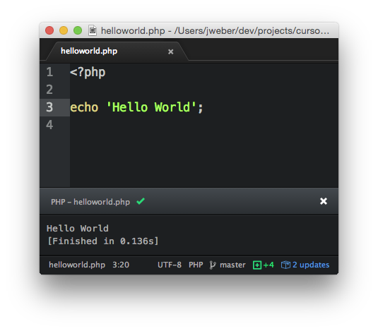

> # Work In Progress
> ## anyone request is well received!

# Curso PHP: empecemos!
Guia de estudo del curso gratuito de PHP adaptado por angel como material de estudio.

## Objetivo
Enseñar el lenguaje PHP para que los estudiantes mejoren sus competencias en el área y así, al finalizar el curso, tengan un amplio conocimiento de las nociones básicas del mismo, permitiéndoles participar y/o desarrollar proyectos que involucren dicho lenguaje, así como en otras actividades relacionadas con la programación. El objetivo general es, por tanto, preparar a los alumnos en la teoría y en la práctica para que puedan programar de la "manera correcta".
Para lograr tales objetivos, se hace necesario identificar objetivos específicos. Estos serían:
* Proporcionar a los participantes conocimientos sobre desarrollo Web, utilizando el lenguaje PHP, en su versión más reciente.
* Ofrezca a los participantes condiciones para mejorar sus habilidades mediante la creación de aplicaciones prácticas y simplificadas.
* Fortalecer el uso de buenas prácticas durante la programación.

## Público Alvo
* Desenvolvedores
* Analistas de Sistemas
* Engenheiros de Software
* Gerentes de Projeto
* Estudantes

## Custo
> puedes tomarlo en tus tiempos libres.

## Local
campus lands floridablanca.

## Slides
* [diapositivas de guia, en brasileño.](https://docs.google.com/presentation/d/1OfMrN9vbRI84ZZba7MlyWQWmG0aBz1Nt9Wv2_yQQEnc/edit?usp=sharing)


## Visualizando los ejemplos
crear servidor [este tutorial básico](#servidor-web) y accede a la dirección ```http://localhost:9000/exemplos/``` en tu navegador.

## Contenido (WIP)
 introducción de php
* ¿Qué es?
* ¿Como surgió?
* algunos proyectos

Preparando o ambiente
* Instalando PHP 5.5 / 5.6
* Utilizando o Servidor Embutido
* SublimeText

Paradigmas de Desenvolvimento
* Programacion Orientada a Objetos
* Programacion Funcional

PHP Básico.
* Tipos Primitivos / Variables
* Operadores de Comparacion
* Argumentos Condicionales
* Switch / For / Foreach - ciclos
* Trabrabajando con Strings
* Operadores Ternarios
* Arrays

PHP Orientado a Objetos
* Pensamento Orientado a Objetos
* Primeros Princípios
* Classes vs Objetos
* Creando classes
* Atributos, Métodos e Assinaturas
* Estendendo classes
* Namespaces
* Modificadores de acesso
* Polimorfismo
* Encapsulamento
* Creando e entendendo interfaces
* Creando classes e métodos abstratos
* Traits

PSRs (1, 2, 3 e 4)
* ¿Qué son y para qué sirven?

Generamiento de Dependendencias
* ¿Qué son las dependencias?
* Trabajando con Composer y Packagist
* Instalando
* Entendiendo Composer.json
* Descargando dependencias
* Descripción del cargador automático
* Composer.lock
* Hablando de Packagist
* Envío de un paquete

Trabajar con PHP desde la línea de comandos
* ¿Qué cambia en la práctica?
* Qué puedo hacer
* creando rutinas

Biblioteca estándar de PHP (SPL)
*¿Qué es SPL?
* Trabajar con iteradores
* Interfaces
* Exceptions
* Funciones
* Clases de Interfaces

hablando de base de datos
* Clases nativas
* MySQL vs MySQLi
* Classe PDO

almacenamiento en caché
* ¿Qué es el almacenamiento en caché?
* Beneficios
* caché de código de bytes
* Object cache

Seguridad
* Data Filtering
* Sanatization
* SQL Injection

pruebas automatizadas
* ¿Qué son las pruebas?
* Beneficios
* hablando sobre TDD
* Tipos de pruebas
* Unitario / Aceptación

PHPUnit
* Instalando
* Primeros pasos
* setUp y TearDown
* Creo nuestra primera prueba
* ejecutando pruebas
* Configurando bootstrap
* Cobertura de código

# Introducción a PHP
## ¿Qué es PHP?
PHP (un acrónimo recursivo de PHP: preprocesador de hipertexto) es un lenguaje de secuencias de scripts [open source](http://git.php.net/) de uso general, muy utilizada, y especialmente adecuado para el desarrollo web y se puede incrustar en HTML.

Por ejemplo:

```php
<!DOCTYPE HTML PUBLIC "-//W3C//DTD HTML 4.01 Transitional//EN"
    "http://www.w3.org/TR/html4/loose.dtd">
<html>
    <head>
        <title>Ejemplo</title>
    </head>
    <body>

        <?php
        echo "hola, un soy un script PHP!";
        ?>

    </body>
</html>
```

El código PHP está delimitado por [iniciar y finalizar instrucciones de procesamiento (etiquetas) ```<?php``` y ```?>```](http://php.net/manual/en/language.basic-syntax.phpmode.php) que le permiten entrar y salir del "modo PHP".

## Historia
Creado en 1994 por [Rasmus Lerdof](https://pt.wikipedia.org/wiki/Rasmus_Lerdorf), La primera encarnación de PHP fue un conjunto simple de binarios de Common Gateway Interface (CGI) escritos en el lenguaje de programación C.

Utilizado originalmente para el seguimiento de las visitas de su currículum en línea, nombró al conjunto de scripts "Herramientas de la página de inicio personal", más a menudo denominadas "Herramientas PHP". Con el tiempo, se deseaba más funcionalidad y Rasmus reescribió PHP Tools, produciendo una implementación mucho más rica.

En Junio de 1995, Rasmus [libero](https://groups.google.com/forum/#!msg/comp.infosystems.www.authoring.cgi/PyJ25gZ6z7A/M9FkTUVDfcwJ) el código fuente de PHP Tools al público, lo que permitió a los desarrolladores usarlo como quisieran. Esto permitió, y alentó, a los usuarios a corregir errores en el código y, en general, mejorarlo.

Lee mas en:
* [Historia de PHP (PT BR)](http://php.net/manual/pt_BR/history.php.php)
* [PHP Museum](http://museum.php.net/)
* [Video: PHP Development History 2014](https://www.youtube.com/watch?v=ULjUgdxNaHg)

## Popularidad

PHP siempre ha sido muy popular entre [lenguajes de programación del lado del servidor](https://pt.wikipedia.org/wiki/Linguagem_server-side), hoy, el 81% de las páginas web usan PHP ([w3techs](http://w3techs.com/)). Los sitios web más famosos son:

1. Facebook (tiene su propia versión de PHP llamada [HHVM](http://hhvm.com/))
2. Wikipedia
3. Baidu
4. Yahoo!
5. Tumblr
6. Flickr
7. Wordpress
8. Mailchimp
9. LAD Bible
10. Birchbox
11. SeatGeek
12. Fotolia
13. Flipkart
14. Digg
15. iStockPhoto

> Fuente: [¿Cuáles son los 10 mejores sitios web creados con PHP?](http://www.quora.com/What-are-the-top-10-websites-built-with-PHP)

# Preparando el Ambiente

Utilice siempre la última versión estable de PHP debido a la gran cantidad de funciones y correcciones que se han agregado a lo largo de los años. Actualmente estamos en versión [PHP 5.6](http://php.net/downloads.php).

## Instalando en Windows
Descarga los archivos binarios (.zip) [esta  página](http://windows.php.net/download/) y descomprímelos en la carpeta ```c:\php56``` desde tu computadora. revisa esa carpeta existe  ```c:\php56\php.exe```.Ahora agreguemos PHP a la variable de entorno. [PATH](http://www.windows-commandline.com/set-path-command-line/). escribir [Comando](https://pt.wikipedia.org/wiki/Prompt_de_comando) (ou CMD) el siguiente comando y presione ```ENTER```:

```shell
setx path "%path%;c:\php56"
```

Si no es muy bueno con la línea de comandos, consulte [este tutorial](https://www.java.com/en_US/download/help/path.xml) ya que muestra cómo agregar una ruta a el entorno variable PATH.
## Instalando en Linux

La mejor manera de instalar PHP en una distribución de Linux basada en Unix es usar un [generador de paquetes](https://en.wikipedia.org/wiki/List_of_software_package_management_systems#Linux_distributions). Esto dependerá de la distribución de Linux que esté utilizando. En Ubuntu, una de las distribuciones más populares, la instalarás a través del administrador de paquetes ```apt```. Simplemente escriba el comando a continuación y[asegúrese de que se haya instalado correctamente](#verificando-a-instalação).

```shell
$ sudo apt-get install php5-cli
```
> No incluya el dólar/signo de dólar en el comando.

## Instalando en Mac OSX

En el sistema operativo Macintosh, PHP ya está preinstalado, con mayor frecuencia en la versión ```5.4```. Antes de instalar, [compruebe si ya tiene PHP instalado](#verificando-a-instalação).Si no, la mejor manera de instalarlo en Mac OSX es usar el administrador de paquetes llamado ```Homebrew``` (O solo ```Brew```).

> [Site do Homebrew](http://brew.sh/)

Una vez el ```Homebrew``` se instaló correctamente, simplemente escriba el siguiente comando:

```shell
$ brew install php55
```

Ahora compruebe que PHP se ha instalado correctamente en el [tópico](#verificando-a-instalação) a seguir.

## Verificando la instalacion

Para saber si PHP está correctamente instalado en su sistema operativo, escriba ```php -v``` en CMD (o Shell, para usuarios de Linux) y compruebe si obtiene una respuesta similar a esta:

```shell
$ php -v
PHP 5.6.4 (cli) (built: Dec 24 2014 12:05:33)
Copyright (c) 1997-2014 The PHP Group
Zend Engine v2.6.0, Copyright (c) 1998-2014 Zend Technologies
    with Zend OPcache v7.0.4-dev, Copyright (c) 1999-2014, by Zend Technologies
    with Xdebug v2.2.5, Copyright (c) 2002-2014, by Derick Rethans
```

> No incluya el dólar/signo de dólar en el comando. Este comando se usa para mostrar la versión de PHP instalada en su sistema operativo.

Leer mas:
* [¿Qué significa seguridad de subprocesos cuando descargo PHP?](http://php.net/manual/pt_BR/faq.obtaining.php#faq.obtaining.threadsafety)
* [eBook - PHP Pandas - Instalación](http://daylerees.com/php-pandas-installation/)
* [PHP de la manera correcta - Primeros pasos](http://www.phptherightway.com/#getting_started)

## Editores de Texto

Durante nuestro curso, utilizaremos el [visual studio code](https://visualstudiocode/) como editor de texto para crear nuestros scripts PHP. Es un editor de código abierto y fue desarrollado por el equipo de [microfotf](https://microsotf.com/).Hacer [aqui](https://microsotf/) descarga el binario e instalalo en tu computadora de acuerdo a tu sistema operativo, si es de tu preferencia tambien puedes usar otro entordo de programacion.


## Hello, World

Una vez que nuestro [ambiente de desenvolvimento está preparado](#preparando-o-ambiente), vamos a ejecutar nuestro primer script PHP. Hay varias formas de ejecutarlo, una de ellas es a través de Terminal (o CMD, en el caso de Windows), escribe el siguiente comando:

```shell
$ php -r 'echo "Hello World";'
```
> php -r 'code' (Ejecuta el código PHP sin etiquetas de script <?php..?>)

Otra forma es crear un archivo. ```helloworld.php``` con el siguiente contenido:

```php
<?php

echo "Hello World";
```
Para executar este script en Terminal, digite:

```shell
$ php -f helloworld.php
```

También es posible ejecutar scripts PHP directamente desde Atom.io, abra el archivo ```helloworld.php``` en el editor y prensa```ctrl-shift-b```(ou ```cmd-i```, no OSX).

Se abrirá un cuadro con la salida del script, así:



## Servidor Web

La forma más popular de ejecutar scripts PHP es junto con un servidor web como [Apache](http://www.apache.org/), [Nginx](http://nginx.org/) ou [Lighttpd](http://www.lighttpd.net/).Pero, lo que mucha gente no sabe es que PHP, desde su versión ```5.4```, ya trae uno [servidor web incorporado](http://php.net/manual/pt_BR/features.commandline.webserver.php).

Para usarlo, simplemente escriba el siguiente comando:
```shell
$ php -S localhost:9000
```
De esta forma, PHP levantará un servidor web en el puerto. ```9000``` y especifique la carpeta actual como su [```docroot```](http://www.karelia.com/support/sandvox/help/z/Document_Root.html).

Vea la salida a continuación y tenga en cuenta la corriente ```Document Root```:

```shell
PHP 5.4.17 Development Server started at Mon Aug 17 16:08:21 2015
Listening on http://localhost:9000
Document root is /Users/jweber/dev/projects/curso-php-free
Press Ctrl-C to quit.
```
Si quieres forzar otro camino como ```docroot```, agregue al comando anterior el atributo ```-t```, conseguir de esta manera:

```shell
$ php -S localhost:9000 -t c:\www
```

Ahora la salida se verá así:

```shell
PHP 5.4.17 Development Server started at Mon Aug 17 16:08:21 2015
Listening on http://localhost:9000
Document root is c:\www
Press Ctrl-C to quit.
```

Abra este link [http://localhost:9000/helloworld.php](http://localhost:9000/exemplos/helloworld.php) en su navegador y vea el resultado de su secuencia de comandos. Si no, recibirás un mensaje. ```HTTP 404 (page not found)```.

> Recuerde que el archivo ```helloworld.php``` debe estar dentro de la carpeta ```docroot```, por ejemplo: ```c:\www\helloworld.php```

¡Felicidades! Acabas de ejecutar tu primer script PHP:)

## phpinfo
> Muestra una gran cantidad de información sobre el estado actual de PHP. Esto incluye información sobre las opciones y extensiones de compilación de PHP, la versión de PHP, la información del servidor y el entorno (si se compila como un módulo), el entorno de PHP, la información de la versión del sistema operativo, las rutas, los valores clave y las ubicaciones de las opciones de compilación, configuración, encabezados HTTP y la licencia de PHP.

**Ejemplo - phpinfo()**
```php
<?php

// Mostra todas as informações, usa o padrão INFO_ALL
phpinfo();

// Mostra apenas informações dos módulos.
// phpinfo(8) mostra um resultado identico.
phpinfo(INFO_MODULES);

?>
```

Leer mas:
* [php.net - phpinfo()](http://php.net/manual/pt_BR/function.phpinfo.php)

# PHP Básico
Una vez que seamos capaces de ejecutar scripts PHP, tanto vía CLI (Command-Line Interface) como vía Web Server, a partir de ahora empezaremos a estudiar la sintaxis básica del lenguaje PHP.

## Variables
En PHP, las variables son palabras que comienzan con un signo de dólar. ```$```. Veamos un ejemplo:

```php
<?php

$variavel = 'Hello, World';
$variavel = 3;
$variavel = 1.4;
$variavel = false;
$variavel = 50 == '50'; // true
$variavel = 50 === '50' // false
$variavel = null;
```

PHP no es un  [lenguaje  tipado ](https://pt.wikipedia.org/wiki/Linguagem_tipada), por lo tanto, no especifica el tipo de variable, solo le asigna un valor. Los idiomas con esta característica le permiten cambiar los tipos de datos contenidos en una variable durante la ejecución del programa.

PHP admite ocho [tipos primitivos](http://php.net/manual/pt_BR/language.types.intro.php): ```String```, ```Integer```, ```Boolean```, ```Float```, ```Array```, ```Object```, ```Resource``` y ```NULL```.

## Strings

* Aspas Simples

```php
<?php

echo 'Esta es una cadena simple';

echo 'Además, podrás embarcar en nuevas líneas
en cadenas, esta es una manera
genial para hacer';

// Arnold dijo una vez: "Volveré"
echo 'Arnold dijo una vez: "Volveré"';

// Esto no creará \n una nueva línea
echo 'Esto no creará \n una nueva línea';

$variavel = 'com';
// Las variables no funcionan $variable con las simples
echo 'Las variables no funcionan $variable con comillas simples';
```

*doble comillas- comillas dobles

```php
<?php

$variable = 'Legal';
// Las variables funcionan así: Cool
echo "las Variables funcionan asi: $variable";
```

## Operadores de String
Le permite concatenar o unir cadenas. En algunos idiomas el ```+``` juega este papel, pero en PHP ha sido reemplazado por ```ponto```.

**Ejemplo - Concatenacion de Strings**
```php
<?php
$a = "Hello ";
$b = $a . "World!"; // Ahora $b contiene la cadena "Hello World!"

$a = "Hello ";
$a .= "World!";     // Ahora $a contiene la cadena "Hello World!"
?>
```

Leer mas:
* [php.net - String Operators](http://php.net/manual/en/language.operators.string.php)
* [¿Por qué el operador de concatenación de cadenas php es un punto? (.)?](http://stackoverflow.com/questions/4266799/why-is-the-php-string-concatenation-operator-a-dot)

## Integradores
Un ```integer``` es un número que está contenido en ese intervalo ```Z = {..., -2, -1, 0, 1, 2, ...}```. Y se pueden representar en decimal (base 10), hexadecimal (base 16), octal (base 8) o binario (base 2). los signos de ```-``` o ```+``` son opcionales.

Tipo        | Notación
----------- | -------
Octal       | Número comienza com ```0``` (zero)
Hexadecimal | Número comienza com 0x
Binário     | Número comienza com 0b

> Los binarios literales enteros están disponibles en  ```PHP 5.4```.

**Ejemplo - Literales Internos**
```php
<?php
$a = 1234; // decimal number
$a = -123; // a negative number
$a = 0123; // octal number (equivalent to 83 decimal)
$a = 0x1A; // hexadecimal number (equivalent to 26 decimal)
$a = 0b11111111; // binary number (equivalent to 255 decimal)
?>
```

Leer mas:
* [php.net - Integers](http://php.net/manual/en/language.types.integer.php)
* [php.net - String conversion to numbers](http://php.net/manual/en/language.types.string.php#language.types.string.conversion)

## Floating point numbers
Números de punto flotante (también conocido como ```floats```, ```doubles``` o ```real numbers```) se puede escribir en diferentes sintaxis:

```php
<?php
$a = 1.234;
$b = 1.2e3; // 1200
$c = 7E-10;
```

Leer mas:
* [php.net - Floating point numbers](http://php.net/manual/en/language.types.float.php)

## Booleans
Un ```boolean``` representa el "valor de verdad" y puede ser ```TRUE``` o ```FALSE```. Para representarlo, usa las constantes **TRUE** o **FALSE**. Ambos no distinguen entre mayúsculas y minúsculas, es decir, no importa si está en mayúsculas o minúsculas (```True``` y igual a ```TRUE``` que es igual a ```true```).

**Ejemplo**
```php
<?php
$foo = false; // asigna el valor FALSO a $foo

$foo = (50 == '50') // asigna el valor VERDADERO a $foo
$foo = (50 != '50') // asigna el valor FALSO a $foo

$foo = (50 !== '50') // asigna el valor VERDADERO a $foo
$foo = (50 === '50') // asigna el valor FALSO a $foo
```

## NULL
El valor especial **NULL** representa una variable "sin valor".

Se considera una variable ```null``` cuando:
* Asignar la constante ```NULL```;
* Aún no ha asignado ningún valor;
*usando la función [unset()](http://php.net/manual/en/function.unset.php);

```php
<?php
$var = NULL;

$texto = 'Foo Bar'; // $texto es un string
unset($texto); // $texto es NULL
?>
```
> Echa un vistazo a las funciones [is_null()](http://php.net/manual/en/function.is-null.php) y [unset()](http://php.net/manual/en/function.unset.php).

## Arrays
Una array en PHP es en realidad un mapa ordenado. Un mapa es un tipo que relaciona valores con claves. Este tipo está optimizado de muchas maneras, por lo que puede usarlo como un array real o una lista (vector), tabla hash (que es una implementación de mapa), diccionario, colección, pila, cola y probablemente más. Como puede tener otro array PHP como valor, puede simular árboles fácilmente.

**Sintaxe**
```
array(
    chave  => valor,
    chave2 => valor2,
    chave3 => valor3,
    ...
)
```

**Ejemplo - Array Simple**
```php
<?php

$lista = array('Foo', 'Bar', 'Fizz', 'Buzz');

$lista = ['Foo', 'Bar', 'Fizz', 'Buzz']; // php >= 5.4
$numeros = [10, "vinte", 30, 40.8, false, null]; // php >= 5.4

var_dump($numeros);

/*
array(6) {
  [0]=>
  int(10)
  [1]=>
  string(5) "vinte"
  [2]=>
  int(30)
  [3]=>
  float(40.8)
  [4]=>
  bool(false)
  [5]=>
  NULL
}
*/
```

el ```chave``` puede ser un número entero o una cadena. Si el```chave``` es una representación estándar de un número entero, se interpretará así (por ejemplo, "8" se interpretará como 8, mientras que "08" se interpretará como "08"). Los índices de tipo ```float``` será truncado a ```integer```. No hay diferencia entre matrices indexadas y asociativas en PHP, solo un tipo de matriz, que puede tener índices de tipo ```integer``` o ```string```.

**Exemplo - Claves como cadena**

```php
<?php

$variavel = array(
  "foo" => "bar",
  "bar" => "foo",
);

// as of PHP 5.4
$variavel = [
  "foo" => "bar",
  "bar" => "foo",
];

```

**Ejemplo - Accediendo a Valores de un Array**
```php
<?php

$variable = array(
  "somearray" => array(
    6 => 5,
    13 => 9,
    "a" => 42
  )
);

echo $variable["somearray"][6];    // 5
echo $variable["somearray"][13];   // 9
echo $variable["somearray"]["a"];  // 42
```

**Exemplo - Type Casting and Overwriting**
```php
<?php
$array = array(
    1    => "a",
    "1"  => "b",
    1.5  => "c",
    true => "d",
);
var_dump($array);

/*
array(1) {
  [1]=>
  string(1) "d"
}
*/
?>
```

**Exemplo - Mixed integer and string keys**
```php
<?php
$array = array(
    "foo" => "bar",
    "bar" => "foo",
    100   => -100,
    -100  => 100,
);
var_dump($array);

/*
array(4) {
  ["foo"]=>
  string(3) "bar"
  ["bar"]=>
  string(3) "foo"
  [100]=>
  int(-100)
  [-100]=>
  int(100)
}
*/
?>
```

Leer mas:
* [php.net - Arrays](http://php.net/manual/pt_BR/language.types.array.php)

## Manipulando Arrays
También puede modificar un array existente asignándole valores explícitamente.

Esto se hace simplemente asignando valores al array y especificando la clave entre corchetes. Puede omitir la llave encerrando un par de corchetes vacíos. ("[]").

```
$arr[chave] = valor;
$arr[] = valor;
```
> clave tanto uno [integer](http://php.net/manual/pt_BR/language.types.integer.php) o [string](http://php.net/manual/pt_BR/language.types.string.php)
> el valor puede ser cualquier cosa

```php
<?php
$arr = array(5 => 1, 12 => 2);

$arr[] = 56;    // Esto es lo mismo que $arr[13] = 56;
                // en este punto del script

$arr["x"] = 42; // Esto añade un nuevo elemento.
                // para matriz con clave "x"

unset($arr[5]); // Esto elimina un elemento del array.
unset($arr);    // Y esto borra todo el array.
?>
```

Leer mas:
* [php.net - Arrays](http://php.net/manual/pt_BR/language.types.array.php)

## Operadores de Comparacion
Los operadores de comparación, como su nombre lo indica, le permiten comparar dos valores. Usted podría estar interesado en ver el [tabelas de comparação de tipos](http://php.net/manual/pt_BR/types.comparisons.php),que tiene un ejemplo de las diversas comparaciones entre tipos relacionados.

Exemplo	  | Nome           | Resultado
--------- | -------------- | ----------
$a == $b  | Igual          | Verdadero (VERDADERO) si $a es igual a $b.
$a === $b | Identico       | Verdadero (VERDADERO) si $a es igual a $b, y son del mismo tipo (introducido en PHP4).
$a != $b  | Diferente      | Verdadero si $a no es igual a $b.
$a <> $b  | Diferente      | Verdadero si $a no es igual a $b.
$a !== $b	| no identico    | Verdadero de $a no es igual a $b, o no son del mismo tipo (introducido en PHP4).
$a < $b	  | Menor que      | Verdadero si $a es estrictamente menor que $b.
$a > $b	  | Mayor que      | Verdadero si $a es estrictamente mayor que $b.
$a <= $b  | Menor o  igual | Verdadero si $a es menor o igual que $b.
$a >= $b	| Mayor o  igual | Verdadero si $a es mayor o igual que $b.

Si compara un entero con una cadena, la cadena es [convertida para un número](http://php.net/manual/pt_BR/language.types.string.php#language.types.string.conversion). Si compara 2 cadenas numéricas, se compararán como números enteros. Estas reglas también se aplican al comando cambiar.
```php
<?php
var_dump(0 == "a"); // 0 == 0 -> true
var_dump("1" == "01"); // 1 == 1 -> true
var_dump("1" == "1e0"); // 1 == 1 -> true

switch ("a") {
  case 0:
      echo "0";
      break;
  case "a": //nunca se alcanza porque "a" ya se combinó con 0
      echo "a";
      break;
}
?>
```

Leer mas:
* [php.net - Operadores de Comparacion](http://php.net/manual/pt_BR/language.operators.comparison.php)

## Operadores de Incremento/Decremento
PHP admite operadores de incremento y decremento de estilo C previos y posteriores.

Ejemplo |	Nombre          | resultado
------- | --------------- | -------
++$a    | Pre-incremento	| Incrementa $a en uno, luego devuelve $a.
$a++    | Post-incremento	| Devuelve $a, luego incrementa $a en uno.
--$a    | Pre-decremento	| Disminuye $a en uno, luego devuelve $a.
$a--    | Post-decremento	| Devuelve $a, luego disminuye $a en uno.

Leer mas:
* [php.net – Operadores de Incremento/Decremento](http://php.net/manual/pt_BR/language.operators.increment.php)

## Outros Operadores
* [Operadores de Atribuição](http://php.net/manual/pt_BR/language.operators.assignment.php)
* [Operador Bit-a-bit](http://php.net/manual/pt_BR/language.operators.bitwise.php)
* [Operadores de controle de erro](http://php.net/manual/pt_BR/language.operators.errorcontrol.php)
* [Operadores de Execução](http://php.net/manual/pt_BR/language.operators.execution.php)

## Constantes
Una constante es un identificador (nombre) para un solo valor. Como sugiere el nombre, este valor no puede cambiar durante la ejecución del script (con la excepción de [constantes mágicas](http://php.net/manual/pt_BR/language.constants.predefined.php), que no son verdaderas constantes). Las constantes distinguen entre mayúsculas y minúsculas de forma predeterminada. Por convención, los identificadores constantes siempre están en mayúsculas.

**Ejemplo - Constantes válidas e inválidas**
```php
<?php

// Valid constant names
define("FOO",     "something");
define("FOO2",    "something else");
define("FOO_BAR", "something more");

// Invalid constant names
define("2FOO",    "something");

// This is valid, but should be avoided:
// PHP may one day provide a magical constant
// that will break your script
define("__FOO__", "something");

?>
```

Leer mas:
* [php.net - Constantes](http://php.net/manual/pt_BR/language.constants.php)

## Operadores Aritméticos

Exemplo |	Nome            | Resultado
------- | -------------   | ---------
-$a	    | Negacion	      | Opuesto de $a.
$a + $b	| Adicion         |	Suma de $a y $b.
$a - $b	| Subtracion      |	Diferencia entre $a y $b.
$a * $b	| Multiplicacion  |	Producto de $a y $b.
$a / $b	| Division	      | Cociente de $a por $b.
$a % $b	| Módulo	        | Resto de $a dividido por $b.

> El operador de división ```/``` siempre devuelve un valor de punto flotante a menos que ambos operadores sean números enteros

PHP tiene numerosas [funciones matemáticas](http://php.net/manual/pt_BR/ref.math.php), como por ejemplo:

```php
<?php
print pi();        // 3.1415926535898 "Valor de PI"
print ceil(5.4);   // 6 "redondeo"
print hypot(3, 4); // 5 "Calcula a Hipotenusa"
print max([50, 550, 40, 45, 44]); // 550 "Encontra o valor máximo"
```

Leer mas:
* [php.net - Operadores Aritméticos](http://php.net/manual/pt_BR/language.operators.arithmetic.php)
* [php.net - Funciones matemáticas](http://php.net/manual/pt_BR/ref.math.php)

## Operadores Lógicos

Ejemplo     |	Nombre  | Resultado
----------- | ----- | ---------
$a and $b	  | E	    | Verdadero (**TRUE**) si tanto $a como $b son verdaderos.
$a or $b	  | OU    |	Verdadero si $a o $b es cierto.
$a xor $b   |	XOR   |	Verdadero si $a o $b son verdaderos, pero no ambos.
! $a	      | NÃO	  | Verdadero si $a no es cierto.
$a && $b	  | E	    | Verdadero si tanto $a como $b son verdaderos.
$a \|\| $b	| OU	  | Verdadero si $a o $b es cierto.
Leer mas:
* [php.net - Operadores Lógicos](http://php.net/manual/pt_BR/language.operators.logical.php)
* [php.net - Precedência de Operadores](http://php.net/manual/pt_BR/language.operators.precedence.php)

## Estruturas de control
Cualquier script PHP está construido por una serie de instrucciones. Una declaración puede ser una asignación, una llamada de función, un 'bucle', una declaración condicional o incluso una declaración que no hace nada (una declaración vacía). Las declaraciones generalmente terminan con un punto y coma. Además, las declaraciones se pueden agrupar en un grupo de comandos encapsulando un grupo de comandos con llaves. Un grupo de comandos es también una instrucción.

Esta es una lista de estructuras de control en PHP:

* if
* else
* elseif/else if
* while
* do-while
* for
* foreach
* break
* continue
* switch
* return
* require
* include
* require_once
* include_once
* goto

Se puede encontrar información sobre cada uno de ellos. [nessa página](http://php.net/manual/pt_BR/language.control-structures.php).

## If Else

```php
<?php
if ($a > $b)
  echo "a is bigger than b";
?>
```
> Las chaves ```{}``` no son obligatorios cuando la declaración tiene una sola línea

```php
<?php
if ($a > $b) {
  echo "a is bigger than b";
  $b = $a;
}
?>
```
**Ejemplo - Else**
```php
<?php
if ($a > $b) {
  echo "a is greater than b";
} else {
  echo "a is NOT greater than b";
}
?>
```
> la instrucción ```else``` sólo se ejecuta si la expresión de condición de la ```if``` es FALSO, y si tiene expresiones elseif, solo si también devuelven FALSO.

**Ejemplo - Elseif**
```php
<?php
if ($a > $b) {
    echo "a is bigger than b";
} elseif ($a == $b) {
    echo "a is equal to b";
} else {
    echo "a is smaller than b";
}
?>
```

Leer mas:
* [php.net - if](http://php.net/manual/pt_BR/control-structures.if.php)
* [php.net - else](http://php.net/manual/pt_BR/control-structures.else.php)
* [php.net - elseif/else if](http://php.net/manual/pt_BR/control-structures.elseif.php)

## For
El bucle for es el bucle más complejo de PHP. Tiene un comportamiento similar a C. La sintaxis del bucle for es:

```
for (expr1; expr2; expr3)
    statement
```

Analise los siguientes ejemplos. Todos los números de visualización del 1 al 10:
```php
<?php
/* ejemplo 1 */

for ($i = 1; $i <= 10; $i++) {
  echo $i;
}

/* ejemplo 2 2 */

for ($i = 1; ; $i++) {
  if ($i > 10) {
      break;
  }
  echo $i;
}

/* ejemplo 3 */

$i = 1;
for (; ; ) {
  if ($i > 10) {
      break;
  }
  echo $i;
  $i++;
}

/* ejemplo 4 */

for ($i = 1, $j = 0; $i <= 10; $j += $i, print $i, $i++);
?>
```

Es común que muchos usuarios iteren sobre matrices como en el ejemplo a continuación.
```php
<?php
/*
 * Esta es un array con algunos datos que deben modificarse.
 * durante una ejecucion do loop for.
 */
$people = array(
  array('name' => 'Kalle', 'salt' => 856412),
  array('name' => 'Pierre', 'salt' => 215863)
);

for($i = 0; $i < count($people); ++$i) {
  $people[$i]['salt'] = mt_rand(000000, 999999);
}
?>
```

PHP también admite la sintaxis alternativa de "dos puntos" para el bucle for.
```
for (expr1; expr2; expr3):
    statement
    ...
endfor;
```
Leer mas:
* [php.net - For](http://php.net/manual/pt_BR/control-structures.for.php)

## Foreach
O ```foreach```permite iterar arreglos y objetos de una manera mucho más simple. Hay dos formas de usarlo:

```
foreach (array_expression as $value)
    statement
```
```
foreach (array_expression as $key => $value)
    statement
```

**Ejemplo - Foreach**
```php
<?php
$arr = array(1, 2, 3, 4);
foreach ($arr as $value) {
  echo $value;
}

/*
Output
1234
*/
?>
```

**Ejemplo - Interando un rango de 0 a 100**
```php
<?php
foreach (range(0, 100) as $numero) {
  echo $numero . PHP_EOL;
}
?>
```

**Ejemplo - Interando un MapList**
```php
<?php
$produtos = array(
  ['nome' => 'XBOX', 'precio' => 3999.90],
  ['nome' => 'TV 50"', 'precio' => 7500.00],
  ['nome' => 'Celular Moto X', 'precio' => 820.50],
);

foreach ($produtos as $produto) {
  echo "Nome: {$produto['nome']}, Precio: {$produto['precio']}" . PHP_EOL;
}

/*
Nome: XBOX, Precio: 3999.9
Nome: TV 50", Precio: 7500
Nome: Celular Moto X, Precio: 820.5
*/
?>
```

**Ejemplo - Interando un MapList 2**
```php
<?php
$pessoa = ['nome' => 'João', 'idade' => 25];
foreach ($pessoa as $campo => $valor)
  echo "{$campo}: {$valor}" . PHP_EOL;

/*
nome: João
idade: 25
*/
?>
```

Leer mas:
* [php.net - Foreach](http://php.net/manual/pt_BR/control-structures.foreach.php)

## While
Con una sintaxis muy similar al lenguaje C, ```while```es una forma sencilla de hacer bucles:

```
while (expr)
    statement
```
```
while (expr):
    statement
endwhile;
```

**Ejemplo - Imprimiendo de 1 a 10 con While**
```php
<?php
$i = 1;
while ($i <= 10) {
  echo $i++;
}

/*
12345678910
*/
?>
```

Leer mas:
* [php.net - While](http://php.net/manual/pt_BR/control-structures.while.php)

## Switch

```php
<?php
if ($i == 0) {
  echo "i equals 0";
} elseif ($i == 1) {
  echo "i equals 1";
} elseif ($i == 2) {
  echo "i equals 2";
}

switch ($i) {
  case 0:
    echo "i equals 0";
    break;
  case 1:
    echo "i equals 1";
    break;
  case 2:
    echo "i equals 2";
    break;
}
?>
```

Leer mas:
* [php.net - Switch](http://php.net/manual/pt_BR/control-structures.switch.php)

## Operador Ternário
Otro operador condicional es el operador "?:" (o ternario). La expresion ```(expr1) ? (expr2) : (expr3)```se evalúa como expr2 si expr1 se evalúa como VERDADERO, o expr3 si expr1 se evalúa como FALSO.
```php
<?php
$idade = 21;
echo $idade >= 18 ? 'Eres mayor de edad' : 'Eres menor de edad';

// outputs 'É maior de idade'
?>
```
> Si el valor de la primera expresión es "VERDADERO" (distinto de cero), devuelve el valor de la segunda expresión. Si la primera expresión es "FALSO", devolverá el valor de la tercera expresión.

Leer mas:
[php.net - Operador Ternário](http://php.net/manual/pt_BR/language.operators.comparison.php#language.operators.comparison.ternary)

## Include / Require
la instrucción ```include``` incluye y evalúa un archivo específico.

Los archivos se incluyen en función de la ruta del archivo proporcionada o, si no se especifica ninguna ruta, el[include_path](http://php.net/manual/pt_BR/ini.core.php#ini.include-path) especificado. Si el archivo no se encuentra en [include_path](http://php.net/manual/pt_BR/ini.core.php#ini.include-path), la declaración de inclusión luego verificará si el archivo existe en el directorio donde se ejecuta la inclusión y en el directorio actual, solo para fallar después. El constructor de inclusión emitirá una advertencia si no puede encontrar el archivo; comportamiento diferente a [require](http://php.net/manual/pt_BR/function.require.php), lo que arrojará un error fatal.

**Ejemplo - Usando o Include en PHP**
* archivo01.php

```php
<?php
$texto = 'Trabajando con Incluir en PHP';

function doblar($numero)
{
  return $numero * 2;
}
```

* arquivo02.php

```php
<?php

include 'arquivo01.php';

echo doblar(4); // 8
echo $texto; // Trabajando con incude en PHP
```

Leer mas:
* [php.net - Include](http://php.net/manual/pt_BR/function.include.php)

## Funciones
Una función se puede definir usando la siguiente sintaxis:
```php
<?php

function foo ($arg_1, $arg_2, /* ..., */ $arg_n)
{
  echo "Ejemplo de funcion.\n";
  return $valor_retornado;
}

?>
```

Los valores serán devueltos si se usa la palabra ```return```. Puede devolver valores de cualquier tipo, incluidos Arrays y Objects.
> IMPORTANTE: Si no utiliza el```return```, un valor **NULL** será retornado.

**Ejemplo - Retornando Valores**
```php
<?php
function square($num)
{
  return $num * $num;
}
echo square(4);   // outputs '16'.
?>
```

**Ejemplo - Retornando Valores y Obtendo Multiplos Valores**
```php
<?php
function numeros_pequeños()
{
  return array (0, 1, 2);
}
list ($zero, $um, $dois) = numeros_pequeños();
?>
```
> Ver la documentación de la función [list()](http://php.net/manual/pt_BR/function.list.php).

En PHP 7, será posible definir el tipo de valor devuelto por la función (como el ejemplo a continuación). Vea esta y otras características de PHP 7 [nessa página](http://php.net/manual/en/migration70.new-features.php).
```php
<?php
function sum($a, $b): float
{
  return $a + $b;
}

var_dump(sum(1, 2)); // outputs 'float(3)'
?>
```

Leer mas:
* [php.net - Funções definidas pelo usuário](http://php.net/manual/pt_BR/functions.user-defined.php)
* [php.net - Retornando Valores](http://php.net/manual/en/functions.returning-values.php)

## Valor de Argumento Padre
PHP le permite especificar un valor predeterminado para los argumentos de la función, haciéndolos opcionales.

```php
<?php
function makecoffee($type = "cappuccino")
{
    return "Making a cup of $type.\n";
}
echo makecoffee();
echo makecoffee(null);
echo makecoffee("espresso");
?>
```
El resultado del fragmento de código anterior será:
```
Hacer una taza de capuchino.
Haciendo una taza de .
Hacer una taza de espresso.
```
**Exemplo - Uso incorreto de argumento padre**
```php
<?php
function makeyogurt($type = "acidophilus", $flavour)
{
  return "Making a bowl of $type $flavour.\n";
}

echo makeyogurt("raspberry");   // won't work as expected
?>
```
El código anterior devolverá un mensaje de error:
```
Advertencia: Falta el argumento 2 en la llamada a makeyogurt() en
/usr/local/etc/httpd/htdocs/phptest/functest.html en la línea 41
Hacer un cuenco de frambuesa.
```

**Ejemplo - Uso correto de argumento padre**
```php
<?php
function makeyogurt($flavour, $type = "acidophilus")
{
  return "Making a bowl of $type $flavour.\n";
}

echo makeyogurt("raspberry");   // works as expected
?>
```
La respuesta del fragmento de código anterior será:
```
Hacer un tazón de frambuesa acidófila.
```

Leer mas:
* [php.net - Default argument values](http://php.net/manual/en/functions.arguments.php)

## Funciones Anonimas (o Cierres)
Le permite crear funciones sin especificar un nombre. Tienen muchos usos, pero se utilizan principalmente como parámetros de ```callbacks``` a otras funciones.

**Ejemplo - Funcion Anonima**
```php
<?php
echo preg_replace_callback('~-([a-z])~', function ($match) {
  return strtoupper($match[1]);
}, 'hello-world');

// outputs helloWorld
?>
```

**Ejemplo - Asignar una función a una variable**
```php
<?php
$greet = function($name) {
  printf("Hello %s\r\n", $name);
};

$greet('World');
$greet('PHP');
?>
```

También puede incluir variables que están fuera del alcance actual de la función. Para hacer esto, use la palabra ```use```, como se muestra en el siguiente ejemplo:

```php
<?php

$mensagem = 'hello';

// Sem "use"
$ejemplo = function () {
    var_dump($mensagem); // NULL
};
echo $ejemplo();

// Com "use"
$ejemplo = function () use ($mensagem) {
    var_dump($mensagem); // string(5) "hello"
};
echo $ejemplo();

?>
```

Leia mais:
* [php.net - Funções Anônimas](http://php.net/manual/pt_BR/functions.anonymous.php)

## Sintaxis Alternativa para estruturas de control
PHP ofrece una sintaxis alternativa para algunas estructuras de control; a saber, ```if```, ```while```, ```for```, ```foreach```, e ```switch```. En cada caso, básicamente la sintaxis alternativa de els es reemplazar la llave de apertura con dos puntos (:) y la llave de cierre con ```endif;```, ```endwhile;```, ```endfor;```, ```endforeach;```, o ```endswitch;```, respectivamente.

```php
<?php if ($a == 5): ?>
A é igual a 5
<?php endif; ?>
```

La sintaxis alternativa también se aplica a else y elseif. El siguiente es un ejemplo de un if con elseif y else en formato alternativo:```php
<?php
if ($a == 5):
    echo "a equals 5";
    echo "...";
elseif ($a == 6):
    echo "a equals 6";
    echo "!!!";
else:
    echo "a is neither 5 nor 6";
endif;
?>
```

**Exemplo - Sintaxis Alternativa Foreach**
```php
<?php
foreach (range(0, 100) as $i => $number):
  echo $number, PHP_EOL;
endforeach;
?>
```

Leer mas:
*  [php.net - Sintaxis Alternativa para estruturas de control](http://php.net/manual/pt_BR/control-structures.alternative-syntax.php)

## Escapando o HTML
Cuando PHP analiza un archivo, busca el **tags de abertura** e **fechamento**, que le dicen a PHP que comience y deje de interpretar el código entre ellos. Interpretar de esta manera permite que PHP se incruste en todo tipo de documentos, ya que el intérprete de PHP ignora todo menos el par de etiquetas de apertura y cierre. La mayoría de las veces verá PHP incrustado en documentos HTML como en este ejemplo.

```php
<p>esto va a ser ignorado.</p>
<?php echo 'Si bien esto será interpretado.'; ?>
<p>esto tambien va a ser ignorado.</p>
```

Hay diferentes formas de abrir y cerrar un bloque de instrucciones PHP.

```php
<?php
    echo 'esto es una prueba';
?>

<?php echo 'esto es una prueba' ?>

<?= 'Esta es una prueba usando una etiqueta de eco corta' ?>

<?php echo 'Omitimos la última etiqueta de cierre';
```

> Tenga en cuenta que no es necesario colocar un ```;``` cuando abre y cierra un bloque de sentencias en la misma línea.

También puedes escapar usando expresiones condicionales avanzadas:
```php
<?php if ($expression == true): ?>
  This will show if the expression is true.
<?php else: ?>
  Otherwise this will show.
<?php endif; ?>
```

Leer mas:
* http://php.net/manual/en/language.basic-syntax.instruction-separation.php
* http://php.net/manual/en/language.basic-syntax.phpmode.php

# Orientado a Objetos

## Objetos
Puede convertir una variable ```array``` para o tipo ```object``` (y vise-versa), fazendo un "casting", de esta manera:

**Ejemplo - Convertendo array a object**
```php
<?php

$lista = ['nome' => 'John Doe', 'idade' => 25];
$objeto = (object) $lista;

var_dump($lista, $objeto);

/*
array(2) {
  ["nome"]=>
  string(8) "John Doe"
  ["idade"]=>
  int(25)
}
object(stdClass)#2 (2) {
  ["nome"]=>
  string(8) "John Doe"
  ["idade"]=>
  int(25)
}
*/
```

## Clase
Cada definición de clase comienza con la palabra clave```class```, sseguido de un nombre de clase, que puede ser cualquier nombre que no sea una palabra reservada en PHP, seguido de un par de llaves, que contienen la definición de los miembros y métodos de la clase. Una pseudovariable, ```$this```, está disponible cuando se llama a un método dentro de un contexto de objeto. ```$this``` es una referencia al objeto de llamada del método (generalmente el objeto al que pertenece el método). Esto se ilustra en el siguiente ejemplo:

**Ejemplo: Classe de PHP**
```php
<?php

class Persona
{

  private $nombre;
  private $sobrenombre;

  public function __construct($nombre, $sobrenombre)
  {
    $this->nombre = $nombre;
    $this->sobrenombre = $sobrenombre;    
  }

  public function getNombreCompleto()
  {
    return $this->nombre . ' ' . $this->sobrenombre;
  }

  public function __destruct()
  {
    echo 'Destruido...';
  }

}

$joao = new Persona('angel', 'angelito');
echo $joao->getNombreCompleto(); // angel  angelito
unset($joao); // Destruido...

?>
```
> Usar el operador de objeto ```->``` para acceder a los atributos y métodos de los objetos.

Leer mas:
* [php.net - O básico](http://php.net/manual/pt_BR/language.oop5.basic.php)

### Visibilidad
La visibilidad de una propiedad o método se puede establecer anteponiendo la declaración con las palabras clave: 'público', 'protegido' o 'privado'. Todo el mundo puede acceder a los elementos declarados como públicos. Protected limita el acceso a las clases heredadas (ya la clase que define el elemento). Private limita la visibilidad solo a la clase que define el elemento.

>Los métodos de clase deben definirse con public, private o protected. Los métodos sin ninguna declaración se definen como públicos.

**Ejemplo: public, protected and private**
```php
<?php

class NombreDeClasse
{

  public $atributoPublico = 'Público';
  protected $atributoProtegido = 'Protegido';
  private $atributoPrivado = 'Privado';

  public function metodoQualquer()
  {
    echo $this->atributoPublico;
    echo $this->atributoProtegido;
    echo $this->atributoPrivado;
  }

}

$instancia = new MyClasse();
echo $instancia->atributoPublico; // OK
echo $instancia->atributoProtegido; // Fatal Error
echo $instancia->atributoPrivado; // Fatal Error
$instancia->metodoQualquer(); // PúblicoProtegidoPrivado

?>
```
Leer mas:
* [php.net - Visibilidade](http://php.net/manual/pt_BR/language.oop5.visibility.php)

## Método Estático
PHP también le permite acceder a los métodos de forma estática. (sem utilizar o ```new```). Solo necesitas agregar la palabra clave ```static``` en la firma del método, como se muestra a continuación:
```php
<?php

class MiClasse
{

  public function metodoNormal()
  {
    echo 'Método normal';
  }

  public static function metodoEstatico()
  {
    echo 'Método Estático';
  }

}

MiClasse::metodoNormal(); // Error
MiClasse::metodoEstático(); // Método Estático

$instancia = new MinhaClasse();
$objeto->metodoNormal(); // Método normal
$objeto->metodoEstatico(); // Método Estático
```

Leer mas:
* [php.net - Operador de Resolucion de Escopo (::)](http://php.net/manual/pt_BR/language.oop5.paamayim-nekudotayim.php)
* [php.net - Palavra-Clave 'static'](http://php.net/manual/pt_BR/language.oop5.static.php)

## Herencia
En Orientación a Objetos, la clase que "extiende" otra clase, hereda todos los métodos y atributos de la clase "padre", excepto aquellos con el modificador de acceso "privado". En PHP, la herencia de clases se realiza mediante la palabra clave ```extends``` seguido de la clase "padre", como se muestra a continuación:
```php
<?php

class Pai
{
  public $atributo = 'Atributo Qualquiera';

  public function hello()
  {
    echo 'Hello World';
  }
}

class Filho extends Pai
{
  public function getAtributo()
  {
    return $this->atributo;
  }
}

$filho = new Filho();
$filho->hello(); // Hello World
echo $filho->getAtributo(); // Atributo Qualquiera

$pai = new Pai();
$pai->hello(); // Hello World
echo $pai->getAtributo(); // Error

```

Leer mas:
* [php.net - Extends](http://php.net/manual/pt_BR/language.oop5.inheritance.php)

## Clase Abstrata
Para definir una clase como abstracta, simplemente use la palabra ```abstract``` na assinatura da classe (conforme exemplo abaixo). la firma de la clase (como se muestra a continuación). La única diferencia entre la clase abstracta y la concreta es que no se permite tener una instancia (palavra clave ```new```) de una clase abstrata.

**Ejemplo - Clase Abstrata**
```php
<?php

abstract class Pai
{
  public $atributo = 'Atributo Qualquer';

  public function hello()
  {
    echo 'Hello World';
  }
}

class Filho extends Pai
{
  public function getAtributo()
  {
    return $this->atributo;
  }
}

$filho = new Filho();
$filho->hello(); // Hello World
echo $filho->getAtributo(); // Atributo Qualquer

$pai = new Pai(); // Fatal error: Cannot instantiate abstract class Pai
```

## Método Abstrato
É um método sem implementação, mas que obriga a classe "filha" a implementá-la. Importante é que a classe precisa ser abstrata se ela quiser ter pelo menos uma método abstrato. Veja a ilustração abaixo e entenda como funciona um método abstrato no PHP.

**Exemplo - Método Abstrato**
```php
<?php

abstract class Pai
{
  abstract function fooBar();

  public function getAtributo()
  {
    return $this->atributo;
  }
}

class Filho extends Pai
{
  public function fooBar()
  {
    echo 'É obrigatório implementar esse método!';
  }
}
```

Leia mais:
* [php.net - Classes Abstratas](http://php.net/manual/pt_BR/language.oop5.abstract.php)

## Constantes de Objeto
É possível definir constantes em cada classe como um atributo imutável. A diferença com as variáveis está no não uso do símbolo ```$```.

> O valor deve ser uma expressão constante, não podendo ser (por exemplo) uma variável, um membro de uma classe, o resultado de uma operação matemática, ou uma chamada de função.

É possível também interfaces terem constantes. Veja na [documentação de interface](http://php.net/manual/pt_BR/language.oop5.interfaces.php) os exemplos.

Leia mais:
* [php.net - Contantes de Objeto](http://php.net/manual/pt_BR/language.oop5.constants.php)

## Namespaces
Por definição, ```namespaces``` é uma maneira de encapsulamento de itens. No PHP, ele resolve basicamente dois problemas quando você utiliza bibliotecas ou re-usa projetos de terceiros:

1. Colisões entre nomes de classe/função/constante do seu projeto com as internas do PHP ou de terceiros.
2. Permite que você crie um apelido curto para as classes/funções/constantes, melhorando a legibilidade do seu código.

O namespace funciona para classes (incluindo abstracts e traits), interfaces, functions e contants. Utiliza-se a palavra-chave ```namespace``` dentro do arquivo antes de qualquer código PHP.

**Exemplo - Sintaxe do Namespace**
```php
arquivo: meu-projeto/app/Escola/Publica/Funcionario.php
<?php

namespace Escola\Publica;

class Funcionario
{
public function calcularSalario() { /* ... */ }
}

?>

arquivo: meu-projeto/app/Escola/Particular/Funcionario.php
<?php

namespace Escola\Particular;

class Funcionario
{
  public function calcularSalario() { /* ... */ }
}

?>

arquivo: application.php
<?php

$funcionario = new Escola\Particular\Funcionario();

// Ou dessa maneira:
use Escola\Particular\Funcionario;
$funcionario = new Funcionario();

// Você criar um apelido curto para a classe também:
use Escola\Particular\Funcionario as FuncParticular;
$funcionario = new FuncParticular();

?>
```

Leia mais:
* [php.net - Namespace overview](http://php.net/manual/pt_BR/language.namespaces.rationale.php)
* [php.net - Namespace definition](http://php.net/manual/pt_BR/language.namespaces.definition.php)

## Interfaces
Interfaces de Objetos permite a criação de código que especifica quais métodos e variáveis uma classe deve implementar, sem ter que definir como esses métodos serão tratados.

Interfaces são definidas usando a palavra-chave 'interface', da mesma maneira que uma classe comum, mas sem nenhum dos métodos ter seu conteúdo definido.

Todos os métodos declarados em uma interface devem ser public, essa é a natureza de uma interface.

**Exemplo - Interfaces**
```php
<?php

interface TemplateInterface
{
  public function setVariable()
}
```
> Interfaces podem ser estendidas como classes, usando o operador [extends](http://php.net/manual/pt_BR/language.oop5.inheritance.php).

### Implements
Para implementar uma interface, o operador ~implements~ é usado. Todos os métodos na interface devem ser implementados na classe; não fazer isso resultará em um erro fatal. Classes podem implementar mais de uma interface se assim for desejado, separando cada interface com uma vírgula.

```php
<?php
interface Motor
{
  public function ligar();
}

interface Volante
{  
  public function esquerda();
  public function direita();
}

class Automovel implements Motor, Volante
{
  public function ligar()
  {
    /* Implementar... */
  }

  public function esquerda()
  {
    /* Implementar... */
  }

  public function direita()
  {
    /* Implementar... */
  }
}
```

Leia mais:
* [php.net - Interfaces de Objetos](http://php.net/manual/pt_BR/language.oop5.interfaces.php)

### Clonando Objetos
Clona-se um objeto quando deseja ter uma cópia fiel de outro objeto, incluindo um novo endereço de memória. Para isso, utiliza-se a palavra-chave ```clone``` antes do nome do objeto, conforme exemplo abaixo:

```php
<?php

class Pessoa
{
  public $nome;

  public function __construct($nome)
  {
    $this->nome = $nome;
  }  
}

$joao = new Pessoa('joao');

$naoCloneJoao = $joao; // Aponta para o mesmo endereço de memória de $joao
$cloneJoao = clone $joao;

$naoCloneJoao->nome = 'Joanete';
$cloneJoao->nome = 'Juarez';

echo $joao->nome; // Joanete
echo $naoCloneJoao->nome; // Joanete
echo $cloneJoao->nome; // Juarez

?>
```

Leia mais:
* [php.net - Clonando objetos](http://php.net/manual/pt_BR/language.oop5.cloning.php)

### Traits
Traits são mecanismos que ajudam a reutilização de código, e servem perfeitamente para resolver o problema da falta de herança múltipla.

```php
<?php
trait Hello
{
  public function ola()
  {
    echo "Olá";
  }
}

class Mundo
{
  use Hello;

  public function world()
  {
    echo $this->ola() . " trait!";
  }
}

$ola = new Mundo();
$ola->world();
// Olá trait!

```

Leia mais:
* [Blog Helio Costa - Traits em PHP. Herança Horizontal](http://hlegius.pro.br/post/traits-em-php.-heranca-horizontal.)
* [Blog Thiago Belem - PHP 5.4 - Traits](http://blog.thiagobelem.net/php-5-4-traits/)
* [php.net - Traits](http://php.net/traits)

## Autoloading classes
Muitos desenvolvedores ao desenvolver aplicações orientadas a objeto criam um arquivo PHP para cada definição de classe. Um dos maiores contratempos é ter de escrever uma longa lista de includes no início de cada script (um include para cada classe necessária).

Para carregar o nosso autoloader vamos precisar usar a função ```spl_autoload_register()``` do PHP que irá registra uma classe e uma função na pilha de carregamento de arquivos, a documentação do PHP chama isso de "pilha de ```__autoload``` da SPL" para efeitos de nome vamos usar "pilha de arquivos". A pilha de arquivos precisa ser ativada para ser usada e a função ```spl_autoload_register()``` já faz isso por padrão, além disso se você estiver usando o ```__autoload()```, ```spl_autoload()``` ou ```spl_autoload_call()``` precisará registrar esta função com o ```spl_autoload_register()```, ele vai substituir todas as 3 que eu citei, ou seja, ao chamar o ```spl_autoload_register()``` elas param de funcionar.

Caso o arquivo carregado não exista ela vai retornar ```false```, caso exista retornará ```true```.

```php
<?php

function my_autoload ($pClassName) {
    include(__DIR__ . "/" . $pClassName . ".php");
}
spl_autoload_register("my_autoload");

?>
```

Leia mais:
* [WebDevBr - Definindo autoloader para múltiplos diretórios - Entendendo o padrão MVC na prática – Parte 03](http://www.webdevbr.com.br/blog/definindo-autoloader-para-multiplos-diretorios-entendendo-o-padrao-mvc-na-pratica-parte-03/)

## php.ini
Arquivo de configuração do PHP. Ele permite configurar [diversas diretivas](http://php.net/manual/pt_BR/ini.list.php) da sua instalação do PHP. Conheça as principais diretivas acessando esse [link](http://php.net/manual/pt_BR/ini.core.php).

Para saber onde está localizado o arquivo ```php.ini``` no seu sistema operacional, digite no shell (ou no prompt de comando) o seguinte comando:
```shell
$ php --ini
```
O resultado será algo parecido com isso:
```shell
Configuration File (php.ini) Path: /Users/jweber/.phpbrew/php/php-5.6.13/etc
Loaded Configuration File:         /Users/jweber/.phpbrew/php/php-5.6.13/etc/php.ini
Scan for additional .ini files in: /Users/jweber/.phpbrew/php/php-5.6.13/var/db
Additional .ini files parsed:      (none)
```

Leia mais:
* [php.net - Descrição das principais diretivas do php.ini](http://php.net/manual/pt_BR/ini.core.php)

## Configurando o TimeZone
Para configurar o timezone no PHP, existe dois principais caminhos:

1. Em tempo de execução via script:
```php
<?php

date_default_timezone_set('America/Bahia');

?>
```

2. Através do arquivo de configuração PHP (php.ini):
```
  date.timezone = America/Bahia
```

> Desde o PHP5.1.0 (quando as funções de data e tempo foram reescritas), toda chamada a esse tipo de função irá gerar um **E_NOTICE** se a timezone não é válida, e/ou uma mensagem **E_WARNING** se estiver utilizando as configurações do sistema ou a variável de ambiente ```TZ```.

Leia mais:
* [php.net - Lista de Timezones suportados](http://php.net/manual/pt_BR/timezones.php)
* [php.net - Configurações em execução](http://php.net/manual/pt_BR/datetime.configuration.php#ini.date.timezone)

## Manipulando datas no PHP
Trabalhar com datas no PHP é uma tarefa muito simples, a classe nativa ```DateTime``` permite fazer coisas incríveis. Veja os exemplos a seguir:

**Exemplo - Criando uma data a partir de uma string**
```php
<?php
$d = DateTime::createFromFormat('m. d. Y', '09. 13. 2015');
echo $d->format('d/m/Y'); // 13/09/2015
?>
```

**Exemplo - Adicionando e removendo intervalos**
```php
<?php
$d = DateTime::createFromFormat('m. d. Y', '09. 13. 2015');

// Adiciona 1 mês e 2 dias.
echo $d->add(new DateInterval('P1M2D'))->format('d/m/Y'); // 19/12/2015

// Remove 3 mêses e 25 dias.
echo $d->sub(new DateInterval('P3M25D'))->format('d/m/Y'); // 30/04/2015
?>
```

**Exemplo - Criando datas a partir de linguagem natural**
```php
<?php
$d = (new DateTime())->modify('last day of this month');
echo $d->format('d/m/Y'); // 30/09/2015
```

Leia mais:
* [php.net - Classe DateTime](http://php.net/manual/en/class.datetime.php)

## Filtrando Valores do Usuário
Em breve.

Leia mais:
* [php.net - Data Filtering](http://www.phptherightway.com/#data_filtering)

## Referências
[php.net - Site oficial do PHP](php.net)  
[PHP The Right Way](phptherightway.com)
